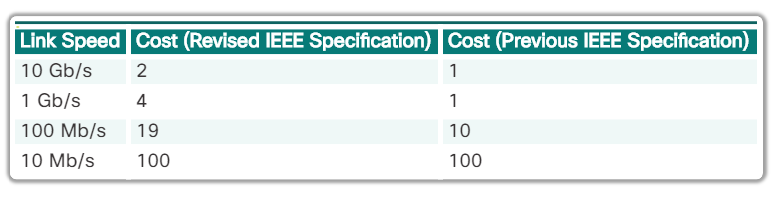
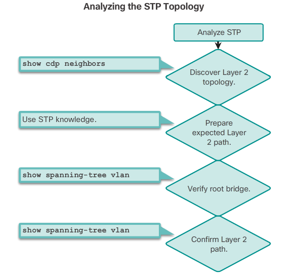

# Spanning Tree Configuration

### Spanning Tree Modes

```
spanning-tree mode pvst
spanning-tree mode rapid-pvst
```

### STP Port Cost Configuration

Default Port Cost Values:



Configure Cost:
```
interface <interface-id>
 spanning-tree cost <value; 1-200,000,000>
```

Restore Default:

```
 no spanning-tree cost <value>
```

### Edge Port Configuration

The RSTP edge port concept *corresponds to the PVST+ PortFast feature*. An edge port is directly connected to an end station and assumes that no switch device is connected to it. RSTP edge ports should immediately transition to the forwarding state, thereby skipping the time-consuming original 802.1D listening and learning port states.

```
spanning-tree portfast
```

The link type is automatically determined, but can be overridden with an explicit port configuration using the `spanning-tree link-type { point-to-point | shared }` command.

### Bridge ID Configuration

To ensure that the switch has the lowest bridge priority value, use:

```
spanning-tree vlan <vlan-id> root primary
```

- The priority for the switch is set to the predefined value of 24,576 or to the highest multiple of 4,096, less than the lowest bridge priority detected on the network.

If an alternate root bridge is desired, use:

```
spanning-tree vlan <vlan-id> root secondary
```

- This command sets the priority for the switch to the predefined value of 28,672. This ensures that the alternate switch becomes the root bridge if the primary root bridge fails. This assumes that the rest of the switches in the network have the default 32,768 priority value defined.

### Root Bridge Configuration

The steps to configure PVST+ on this example topology are:

Step 1. Select the switches you want for the primary and secondary root bridges for each VLAN. For example, in Figure 1, S3 is the primary bridge for VLAN 20 and S1 is the secondary bridge for VLAN 20.

Step 2. Configure the switch to be a primary bridge for the VLAN by using the `spanning-tree vlan <number> root primary` command, as shown in Figure 2.

Step 3. Configure the switch to be a secondary bridge for the VLAN by using the `spanning-tree vlan <number> root secondary` command.

```
! S3(config)#:
spanning-tree vlan 20 root primary
spanning-tree vlan 10 root secondary

! S1(config)#:
spanning-tree vlan 10 root primary
spanning-tree vlan 20 root secondary
```

Another way to specify the root bridge is to set the spanning tree priority on each switch to the lowest value so that the switch is selected as the primary bridge for its associated VLAN:

```
! S3(config)#:
spanning-tree vlan 20 priority 4096

! S1(config)#:
spanning-tree vlan 10 priority 4096
```

Display spanning tree configuration details for active interfaces only:

```
show spanning-tree active
```

### Show/Verify Spanning Tree Configuration

```
show spanning tree
show spanning tree summary
```

### Examine Spanning Tree Convergence

```
debug spanning-tree events
```

### Analyzing the STP Topology



To analyze the STP topology, follow these steps:

Step 1. Discover the Layer 2 topology. Use network documentation if it exists or use the `show cdp neighbors` command to discover the Layer 2 topology.

Step 2. After discovering the Layer 2 topology, use STP knowledge to determine the expected Layer 2 path. It is necessary to know which switch is the root bridge.

Step 3. Use the `show spanning-tree vlan` command to determine which switch is the root bridge.

Step 4. Use the `show spanning-tree vlan` command on all switches to find out which ports are in blocking or forwarding state and confirm your expected Layer 2 path.

### PortFast and BPDU Guard

```
interface <intf-id>
  spanning-tree portfast
  spanning-tree bpduguard enable

! To enable on all nontrunking interfaces:
spanning-tree portfast default
spanning-tree portfast bpduguard default
```

### Rapid PVST+ Configuration

```
configure terminal
spanning-tree mode rapid-pvst
interface <interface-id>
  spanning-tree link-type point-to-point
  end
clear spanning-tree detected protocols
```
